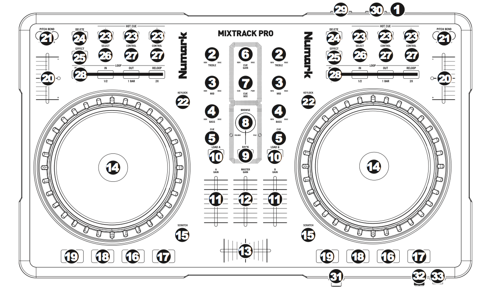

# [midify]-numark-mixtrack-pro [](http://badge.fury.io/js/midify-numark-mixtrack-pro) [](https://gemnasium.com/ben-eb/midify-numark-mixtrack-pro)

> [midify] compatible map for the Numark MixTrack Pro.

Install via [npm](https://npmjs.org/package/midify-numark-mixtrack-pro):

```
npm install midify-numark-mixtrack-pro
```

## What it does

[midify] is a package that combines node's event emitter with the browser's web midi api, to make working with midi messages more palatable. This module provides handlers for the Numark MixTrack Pro, intended to be used with midify, but also provides a reference for the various controls on the device so that it can be used with other modules too!

## Example

Bundle this code with [browserify](https://github.com/substack/node-browserify). Note that Web MIDI is currently available behind a flag in Chrome, and remains unsupported in other browsers. To enable it in Chrome, go to [chrome://flags](chrome://flags) and ensure that the Web MIDI option is on. As of this writing, MIDI support in Chrome is not quite plug and play capable, so you'll need to shut down Chrome and plug your device in before testing any code.

```js
var Midify = require('midify');
var mixtrack = require('midify-numark-mixtrack-pro');

navigator.requestMIDIAccess().then(function(midiAccess) {
    var midiIn;
    var midiOut;

    // For brevity, we are just assuming one MIDI device is connected
    for (var input of midiAccess.inputs.values()) {
        midiIn = input;
    }

    for (var output of midiAccess.outputs.values()) {
        midiOut = output;
    }

    var midify = new Midify({
        midiIn: midiIn,
        midiOut: midiOut,
        controller: mixtrack
    });

    midify.on('*', function(event) {
        console.log('triggered', event, 'event');
    });

}, function() { console.error('MIDI access unavailable'); });
```

## Mapping



Note that the mic gain control at the bottom of the device does not emit any MIDI messages. Substitute `deckX` for `deckA` or `deckB` depending on which side of the controller the control is.

<table>
    <tr>
        <th></th>
        <th colspan="2">Input (midify.on(event, callback))</th>
        <th colspan="2">Output (midify.send(event))</th>
    </tr>
    <tr>
        <td>2</td>
        <td colspan="2">deckX.treble.change</td>
        <td colspan="2"></td>
    </tr>
    <tr>
        <td>3</td>
        <td colspan="2">deckX.mid.change</td>
        <td colspan="2"></td>
    </tr>
    <tr>
        <td>4</td>
        <td colspan="2">deckX.bass.change</td>
        <td colspan="2"></td>
    </tr>
    <tr>
        <td>5</td>
        <td colspan="2">deckX.smallCue.on / deckX.smallCue.off</td>
        <td colspan="2">deckX.smallCue.on / deckX.smallCue.off</td>
    </tr>
    <tr>
        <td>6</td>
        <td colspan="2">cueGain.change</td>
        <td colspan="2"></td>
    </tr>
    <tr>
        <td>7</td>
        <td colspan="2">cueMix.change</td>
        <td colspan="2"></td>
    </tr>
    <tr>
        <td>8</td>
        <td>browse.change (when rotating the control)</td>
        <td>browsePress.on / browsePress.off (when pressing the control in)</td>
        <td colspan="2"></td>
    </tr>
    <tr>
        <td>9</td>
        <td colspan="2">back.on / back.off</td>
        <td colspan="2"></td>
    </tr>
    <tr>
        <td>10</td>
        <td colspan="2">deckX.load.on / deckX.load.off</td>
        <td colspan="2"></td>
    </tr>
    <tr>
        <td>11</td>
        <td colspan="2">deckX.volume.change</td>
        <td colspan="2"></td>
    </tr>
    <tr>
        <td>12</td>
        <td colspan="2">masterGain.change</td>
        <td colspan="2"></td>
    </tr>
    <tr>
        <td>13</td>
        <td colspan="2">crossfader.change</td>
        <td colspan="2"></td>
    </tr>
    <tr>
        <td>14</td>
        <td>deckX.wheel.change (when rotating the wheel)</td>
        <td>deckX.wheelTop.on / deckX.wheelTop.off (when pressing the surface of the wheel)</td>
        <td colspan="2"></td>
    </tr>
    <tr>
        <td>15</td>
        <td colspan="2">deckX.scratch.on / deckX.scratch.off</td>
        <td colspan="2">deckX.scratch.on / deckX.scratch.off</td>
    </tr>
    <tr>
        <td>16</td>
        <td colspan="2">deckX.play.on / deckX.play.off</td>
        <td colspan="2">deckX.play.on / deckX.play.off</td>
    </tr>
    <tr>
        <td>17</td>
        <td colspan="2">deckX.stutter.on / deckX.stutter.off</td>
        <td colspan="2">deckX.stutter.on / deckX.stutter.off</td>
    </tr>
    <tr>
        <td>18</td>
        <td colspan="2">deckX.cue.on / deckX.cue.off</td>
        <td colspan="2">deckX.cue.on / deckX.cue.off</td>
    </tr>
    <tr>
        <td>19</td>
        <td colspan="2">deckX.sync.on / deckX.sync.off</td>
        <td colspan="2">deckX.sync.on / deckX.sync.off</td>
    </tr>
    <tr>
        <td>20</td>
        <td colspan="2">deckX.pitch.change</td>
        <td colspan="2">deckX.pitch.on / deckX.pitch.off (controls the LED next to the fader)</td>
    </tr>
    <tr>
        <td>21</td>
        <td>deckX.pitchUp.on / deckX.pitchUp.off</td>
        <td>deckX.pitchDown.on / deckX.pitchDown.off</td>
        <td colspan="2"></td>
    </tr>
    <tr>
        <td>22</td>
        <td colspan="2">deckX.keylock.on / deckX.keylock.off</td>
        <td colspan="2">deckX.keylock.on / deckX.keylock.off</td>
    </tr>
    <tr>
        <td>23</td>
        <td colspan="2">deckX.kill{{type}}.on / deckX.kill{{type}}.off (where type is Treble, Mid, or Bass)</td>
        <td colspan="2">deckX.kill{{type}}.on / deckX.kill{{type}}.off (where type is Treble, Mid, or Bass)</td>
    </tr>
    <tr>
        <td>24</td>
        <td colspan="2">deckX.delete.on* / deckX.delete.off</td>
        <td colspan="2">deckX.delete.on* / deckX.delete.off</td>
    </tr>
    <tr>
        <td>25</td>
        <td colspan="2">deckX.effect.on / deckX.effect.off</td>
        <td colspan="2">deckX.effect.on / deckX.effect.off</td>
    </tr>
    <tr>
        <td>26</td>
        <td colspan="2">deckX.select.on / deckX.select.off</td>
        <td colspan="2"></td>
    </tr>
    <tr>
        <td>27</td>
        <td colspan="2">deckX.control{{num}}.on / deckX.control{{num}}.off (where num is 1 or 2)</td>
        <td colspan="2"></td>
    </tr>
    <tr>
        <td>28</td>
        <td>deckX.manual, deckX.reloop, deckX.in, deckX.out (all are .on/.off states)</td>
        <td>deckX.manual, deckX.reloop, deckX.in, deckX.out (all are .on/.off states)</td>
    </tr>
</table>

* NB: *Some* controllers may show deck A as having a 'view' button, and deck B as having a 'tick' button in this place. However, the schema defines this as a delete button, and for consistency it is better to name this the same thing.

## License

MIT © [Ben Briggs](http://beneb.info)

[midify]: https://github.com/ben-eb/midify
